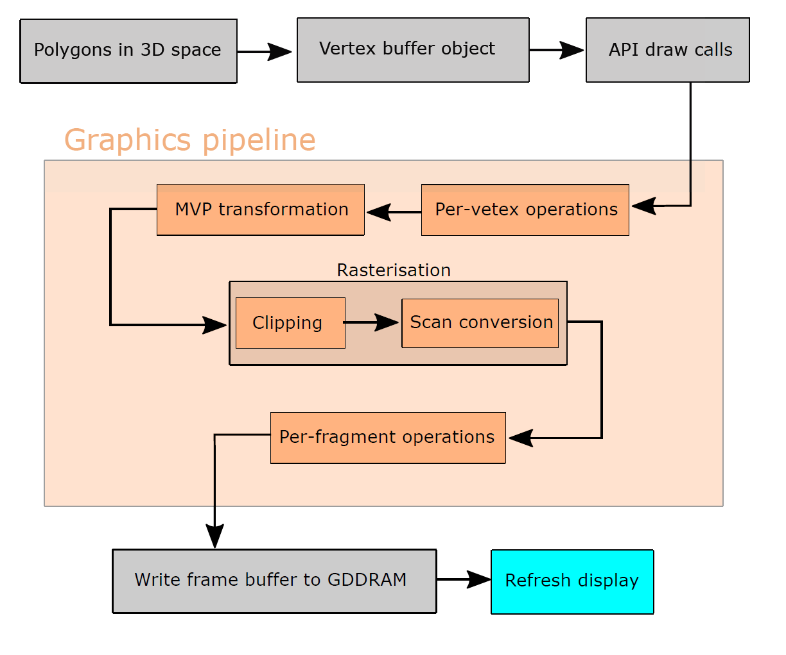
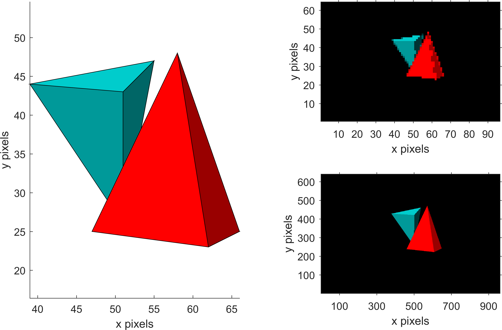

# A light-weight CPU implementation of a 3D graphics pipeline for embedded systems 

Implementation of a light-weight 3D graphics pipeline for embedded systems. The implementation was developed as part of a project in an embedded systems course at Cambridge University (4B25). The C implementations inside the folder `Implementations` specifically target the Freedom KL03 microcontroller unit interfaced with an OLED display based on the SSD1331 driver chip (if interested see `Datasheets`). The KL03 has a very limiting 2 kB SRAM, which has driven the implementation to prioritise memory efficiency over speed. Freedom MCUs are programmed using the Kinetis SDK (KSDK), which is referenced in the C code within `Implementations`, while for simplicity the version in the root folder,  `rasterise.c`, has been stripped and only contains platform-independent steps for the graphics pipeline (with the exception being a command for drawing to the display).

A complete graphics pipeline consists of the following steps:

Some simplifications have had to be made. The fragment shader, that is the per-fragment operations, that would normally be used to implement shading of lighting etc. has simply been impossible to fit into the implementation. 

The implementation currently renders the geometry below (images generated by identical MATLAB implementation):

## Repository layout
(1) The three reports related to the project are present in the `Reports` folder. Most importantly the final project report showing the results of the project. The project proposal and interim report contain more details on the project's subgoals. 

(2) Plots of results, diagram of pipeline and pictures of hardware setup are present in the folder `Figures`.

(3) The source code is in `Implementations/C` and a more platform-independent version stripped of SDK-specific calls is in the root folder, `rasterise.c`. There are a few versions of the implementation. A version without vertex shader based on pre-computed static vertices are in `Implementations/C/NoVert/i2c_comm_master.c`, and a version without Z depth testing is in `Implementations/C/NoZtest/i2c_comm_master.c`.

(4) A MATLAB implementation of the exact same pipeline, which was developed as a prototype before the embedded version, is in `Implementations/MATLAB/rasterise.m`. 

